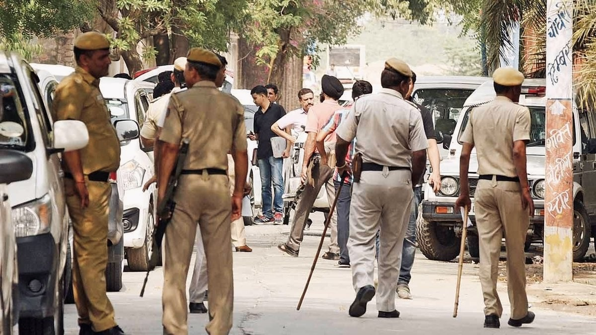

ASSIGNMENTS

(POST1)

Journalism Between Activism and Advocacy

Can journalism coexist with activism and advocacy without compromising the ethics of objectivity?

Most reporters would laugh at the absurdity of the question, as they deem true journalism incompatible with activism. However, as the world shifts, the lines between the two blur, making the initially theoretical question an important point of discussion.

If journalism were to be personified, it would be a circus performer, walking on a thin tightrope, in heels. To the right of the fraying rope lies advocacy, to the left, activism. As journalism treads on this unstable line, the spectators demand a declaration of its allegiance, while all that awaits below is the risk of losing credibility.

But what exactly does this mean?

Journalism is described as "the collection, preparation, and distribution of news and related commentary and feature materials through print and electronic media" by the Merriam-Webster dictionary. Journalism closely adheres to the core principles of truth and accuracy, fairness and impartiality, independence, humanity, and accountability.

Journalism has to be objective. Journalism has to be neutral. Activism doesn’t.  
The Cambridge dictionary defines activism as, “The use of direct and noticeable action to achieve a result, usually a political or social one.” Activists do not aim to reflect alternative viewpoints; they aim to mobilise a like-minded audience to bring about desired change. When journalists become emotionally or politically invested, they compromise their ability to remain impartial. The principle of objectivity, if entirely abandoned, would make journalism indistinguishable from public relations and marketing.

Advocacy, however, occupies a more ambiguous space. At its core, advocacy pertains to pleading another's cause or arguing in support of an idea, event, or person. The Oxford English Dictionary (OED) defines it as 'verbal support or argument for a cause, policy, etc.’ Advocacy operates through persuasion, whereas activism prefers direct action.

But what happens to these distinctions when human rights and areas of public interest are concerned? When reporting sensitive subjects that push a journalist's professional boundaries, is it really possible for them to maintain objectivity and impartiality? Is it feasible to accept "both sides" of an argument with a white supremacist, someone who has morally repugnant and unscientific beliefs about what it means to be human? However, the media risks becoming propaganda megaphones for the powerful when neutrality is completely abandoned.

It is crucial to note that due to journalism’s selective nature, advocacy can surface in subtler ways, causing some voices and issues to be promoted or ignored more aggressively than others. Journalists, much like all individuals, carry preconceptions influenced by their social, political, and cultural backgrounds. These assumptions, along with factors such as the media’s profits, difficulties in filtering out personal values or bias, and the rise of the digital revolution, heavily affect objectivity and credibility.

With the progression of the digital revolution, the concept of objectivity has gradually faded. Journalists utilise objectivity as a tool only when it results in profits. When being more sensational and taking sides will bring them more viewers, they opt to disregard guiding principles. If the ultimate purpose of journalism is anything other than the pursuit of truth, the role of the media risks changing from informative to propagandistic.

There is reasonable concern that activism will corrupt the core values of journalism. The problem rests not in journalists caring for causes but in the rejection of ethical standards. Journalism is inherently linked to advocating for truth and public interest, but it must ensure that this advocacy does not harden into the perpetuation of a single point of view or fall into extreme activism.

(POST 2)

**Minimising Harm in Journalism**

When an individual with no professional journalistic training becomes a journalist, ethical guidelines are simply absent. In today’s digital landscape, one can instantaneously create and spread content. The ability to publish has never been more accessible, and consequently, the responsibility that comes with it has never been more diluted. Journalism has to seek the truth, elevate unheard voices, and publish well-tested facts. However, the average person does not understand the weight of addressing a large audience.

Nonetheless, blaming only citizen journalists would be redundant. Media companies are facing unprecedented structural pressure. The digital revolution has transformed the news production process. Now, news must be produced consistently without interruption. Editorial objectives are increasingly driven by profit and engagement. In this race to stay relevant, accuracy and objectivity are left behind, accountability is lost, and autonomy is diminished.

The principle of minimising harm is staggeringly affected. Minimising harm exists in a more nuanced space. Its boundaries tend to overlap with other principles, making it difficult to enforce or measure. “Minimising harm” is one of the elements of the professional codes of ethics. It states that sources, subjects, colleagues, and members of the public shall be treated as human beings deserving of respect as well as showing heightened sensitivity toward juveniles, victims of sex crime, and individuals who are inexperienced or incapable of consenting. Minimising harm poses essential questions: do we disclose information simply because it is interesting?

The ethics of journalism are something journalists are required to consider with every story they produce. It is not a duty of journalism to share videos in which people are harmed or suffer. At no point should any news organisation intend to invade an individual’s privacy, defame the activities of a person, or mislead others into harm.

A journalist's duty is to inflict as little harm as possible. They must remain careful when looking for or using pictures or conversations with those who encountered tragedy. They must understand that obtaining and publishing information can cause pain. They must avoid catering to morbid curiosity, show caution in identifying sex offence victims or juvenile suspects, and avoid naming criminal suspects until legal charges are filed. Furthermore, they must strike a balance between a suspect’s right to a fair trial and the public’s right to be informed.

Think of a local paper that says in a bold headline, “ICE is here,” even if the article then subsequently specifies that the operation may only affect a few people. Only a handful get past the headline. Such framing causes panic and fails to reduce harm. 

The consequences of journalistic harm, even if unintentional, are dire. In harassment cases, a small group of people are responsible for the abuse while most remain unaware. However, wide media coverage can magnify the problem. This is why the phrase “don’t feed the trolls” exists. While people become more aware, the number of people engaging in harassment also increases, causing victims more agony. By exposing wrongdoing, journalism may polarise and exacerbate the harm of the act.

Journalists will often present two opposing views as equally valid, even when the evidence strongly supports one side. For instance, placing a climate scientist and a climate denialist in the same article and providing credence to both sides by presenting their perspectives as carrying the same weight is misleading. The conclusions drawn by a scientist are backed by research, data, and peer review, while the denialist relies on opinion. Portraying the two as balanced viewpoints is harmful to the public understanding.

Similarly, giving extremists a platform under the guise of debate can disseminate harmful ideas to impressionable audiences. Newspapers were the main entry point for public discussions in earlier times. Today, the Internet is already providing extremists with notable visibility. When mainstream media raises these voices further “for the sake of balance”, they risk allowing the louder voices to dominate. Religion, immigration, and minority coverage are affected by this distortion. When the media concentrates more on extremist elements, it skews public perception away from reality.

Newspapers must acknowledge the enormity of the harm produced by the way they function. They may not have caused the harm, but they play a significant role in perpetuating and supporting the damage. Newspapers do not exist in a vacuum anymore, given the fact that there are now multiple means through which an individual can express themselves and dominate public discourse. It is no longer enough to "bring every side to the table," especially when some sides are already overpowering others.

(POST 3)

**The Hidden Work Behind Bengaluru’s Pet Cafés**

Bengaluru: The pet cafés in Bengaluru function in a planned manner with respect to hygiene and monitoring of behaviour to ensure the safety of the animals, according to a staff member of a Bengaluru-based pet café.

Ashwin Morris (40), manager, said, “The first difference between a café and a pet café is the sense of responsibility. Hygiene is more than a routine,” he said, adding that the feeding bowls, toys, leashes, and water dispensers are cleaned two to three times a day depending on usage and are cleaned immediately if they get dirty. The place also undertakes heavy cleaning and sanitising of the area twice a day. There is a five-member cleaning staff who disinfect the area where the dogs move, play, and sleep.

The staff members also pointed out that monitoring of behaviour is an important part of the functioning of the café. Rahul Alfred Winston (27), a staff member, said that the dogs are closely monitored to avoid distress, overexcitement, or aggression. “Their behaviour can change suddenly,” he said, adding that the staff are trained to recognise early warning signs. Although regular visitors become accustomed to the surroundings, some dogs exhibit signs of anxiety, especially when parted from their owners. Careful interaction is ensured to minimise stress.

The café has a systematic intake process before agreeing to board any dog. Pet owners are required to bring their dogs for the first encounter, followed by a short experience at the daycare. This allows the staff to evaluate the dog’s temperament, level of anxiety, and adaptability to the surroundings before finally allocating boarding information.

The centre is operational 24/7, with an on-call veterinarian in case of emergencies. Minor biting cases are handled by the staff, while those requiring medical attention are referred to a veterinarian.

Morris states that the most challenging part of running the café is dealing with unpredictable behaviour while also keeping pet owners informed. While cleaning and sanitation follow a fixed routine, dogs can react differently depending on their mood and surroundings. He said the staff have to stay alert at all times to ensure the safety of both the animals and visitors, making supervision just as important as hygiene in the functioning of the café.

(POST 4)

**The Neighbourhood Library: A Community of Young Readers**

In January 2021, when the pandemic was escalating, 12-year-old Maryam Jameela, together with her father and brother, came up with an inspiring grassroots movement, “The Neighbourhood Library”.

Maryam, who had always been an avid reader since childhood, thanks to her father’s bookstore, realised that children were being raised with more screen time than book time. She, along with the help of her father, Mirza Abdul Qayyum Nadvi, and brother, Mirza Abdul Hasan Ali, decided to do something for the kids in their area to instil a love for reading in them.

The first libraries were established in almirahs with 300 to 400 books in parking lots, mosques, temples, and residential lawns. Today, the movement has expanded to 36 libraries in Aurangabad, and more in Hyderabad, parts of Madhya Pradesh, and Kashmir.

According to Ali, the movement was started without any expectations, only with the hope that children would have something to read. However, over five years, the libraries have brought about a marked change, especially in the area of leadership training. In some areas, children have come forward on their own to manage the libraries as “young librarians.” Without any staff members, these children are in charge of managing the books and lending them out. Plans are afoot to give them a small salary every month and training in basic record-keeping to give them confidence. The movement specifically encourages girls, including Muslim girls, to take up this task as a step towards empowerment.

Talking about the library as an open, free, and inclusive space, Ali said, “The library is for marginalised groups, especially children and Muslim women. Incidents such as the removal of a woman’s hijab in public send a negative message to society and discourage women.” He further added, “It creates fear and uncertainty among marginalised groups who are already under constant social pressure. This initiative aims to provide access to books, opportunities, and a safe space every day to slowly work towards reducing the fear of exclusion and encourage participation with confidence.”

The team plans to establish 26 additional libraries this year in collaboration with communities, NGOs, and individuals. However, securing space remains a huge difficulty, as the initiative does not pay rent and relies on residents willing to provide modest spaces for libraries. Staffing is also limited due to a lack of institutional funding, with most centres maintained by volunteers, including close friends and local supporters. Though not a registered NGO, the project continues as a community-driven effort, with hopes of formalising hiring and training processes if funding becomes available.

Each library houses children’s literature, picture books, and biographies in Marathi, Hindi, Urdu, and English. The library remains open 24/7 and without locks; the libraries operate on mutual trust within the community.  
Ali acknowledged that some books may be damaged or lost, but this was part of the process of maintaining access without restriction. He also pointed out that the collection is made up mainly of inexpensive children’s books, and that the overall goal is to achieve justice in access.

Using his experience in social work and with UNICEF in the area of child protection and mental health, Ali has strived to make the libraries a safe and welcoming environment. The project has now been extended to over 10,000 children. Children who once lacked access to books have gone on to confidently speak with journalists from outlets such as Aaj Tak and BBC. Ali said the collective growth in children’s confidence and curiosity stands as the project’s greatest success.

He added that communities need not wait for large organisations to act. Even a small shelf of books, he said, can become the foundation of change if communities are willing to adopt, critique, and expand the idea themselves.

(POST 5)

**Rethinking the Fourth Estate: A Personal Take on India’s Press**

When I was a kid, I hated journalists.  
I thought they were invasive, shallow, and loud.

My consumption of media (Disney shows and horror movies) portrayed journalists as apathetic beings uncaring towards others and their boundaries. Well, I guess in Hannah Montana, it wasn’t journalists, but rather paparazzi; nevertheless, it was all the same. I often visualised journalists as vultures, circling around and preying on the weak.

My limited experience with news channels, by that I mean the 5 seconds of news I saw on the tv when I entered my parents’ room, did not stop me from forming an opinion. News was loud, argumentative, and grotesque. That was my conclusion.

As a budding teenager, I was completely removed from anything besides myself. My awareness and interest in the world around me expanded only in the 11th grade. All credit due to my very chatty (and lovely) history and political science teacher. The more I learnt about India’s history, the more I learnt about the history of the press in India.

I began to realise just how misinformed I was. Journalism was a form of resistance and rebellion. And unlike my childhood beliefs, journalists, well, at least the ethical practitioners, were principled. Today, as a student in a journalism-adjacent course, I’m aware that journalism is “The systematic and reliable dissemination of public information, public opinion, and public entertainment by mass media communication.”

India’s evolving journey with journalism began much before the term was ever coined, starting with early structured information systems. The earliest publications were neither on screens nor paper but carved into rocks and pillars. Emperor Ashoka utilised scriptures to disseminate royal policies. Under the Mughal rule, official news writers, known as Waqia Navis, reported events from provinces to the emperor through handwritten newsletters called Akhbars.

Modern journalism only truly began to take shape after the arrival of the British. In 1776, William Bolts was unsuccessful in his attempt to publish the first newspaper in India and was shut down by the East India Company. The first successful newspaper was published in 1780 by James Augustus Hicky.

His newspaper, The Bengal Gazette, also known as Calcutta General Advertiser, was termed as a “weekly political and commercial paper open to all parties but influenced by none.”It contained political commentary, letters to the editor, scandals, and satire. It criticised the colonial government. Hicky was arrested in 1781 for his critical writings, and his press was confiscated. Although it was short-lived, the Bengal Gazette marked the beginning of journalism in India.

The British soon understood that the very existence of a free press in India as a colony would be jeopardised by the potential of the free press to mobilise public opinion and disseminate nationalist sentiments. The Press Regulations of 1799, the Licensing Act of 1857, the Vernacular Press Act of 1878, and the Press Act of 1910 were some of the tough laws that regulated the press in the 19th century. In an attempt to curb nationalist passion, the Vernacular Press Act focused on publications in Indian languages.

Yet, the Indian language press grew. The pioneers were the Serampore Missionaries with Samachar Darpan, and Raja Ram Mohan Roy with his Persian newspaper Mirat-ul-Akbar. Roy stated that his object was to lay before the public such articles of intelligence as may increase their experience and tend to their social improvement, and to indicate to the rulers a knowledge of the real situation of their subjects. He later ceased publication in protest against the Press Regulations. The Bombay Samachar was founded in 1822.

The nationalist press grew in strength during the latter part of the nineteenth century. Publications such as Kesari, edited by Bal Gangadhar Tilak, defied the Government’s attempts to crush nationalist aspirations. The Amrita Bazar Patrika began publishing in English after the Vernacular Press Act came into force, since the Act did not apply to English dailies. In the period 1908-1912, new laws such as the Press Act of 1910 granted the Government the power to demand a security fee for “offensive matter,” and nearly 1,000 publications were prosecuted.

After Independence, the freedom of the press is guaranteed by Article 19(1)(a) of the Constitution, but is liable to “reasonable restrictions” by Article 19(2). The Press Council of India was established in 1966 as an “autonomous, statutory, quasi-judicial” body.

The Emergency was declared on 25 June 1975 by Fakhruddin Ali Ahmed under Article 352(1) on the advice of Indira Gandhi. The civil rights were suspended, and the news media were strictly controlled. The censors appointed by the government had to scrutinise all news articles about the Emergency. In a gesture of silent protest, publications such as The Statesman and The Indian Express published blank editorials, while The Times of India published a mock obituary notice for “D.E.M. O'Cracy.”

Following the Emergency in 1977, the Indian media restored its constitutional protections, and the Press Council of India was revamped to uphold press freedom and ethics. Since that time, the Indian media has undergone a fundamental change influenced by numerous political, legal, and technological elements. India has been ranked very low in the World Press Freedom Index, ranking 151 out of 180 countries in 2025, due to concerns about the decreased freedom of the media, legal restrictions, and corporate power. Currently, the media face a very challenging situation as new avenues for reporting, using digital media, have been accompanied by greater competition and the challenge of disinformation. While technology has made news more available and provided avenues for alternative media, the media face challenges of lawsuits, cyberbullying, and editorial restrictions when reporting on sensitive issues. The need for regulation in the media industry, the use of AI in the media, and court rulings in favour of the freedom of the press are some of the issues that the media face in this rapidly changing world.

BEAT REPORTING

(POST 1)

**Analysing a News Report: Bengaluru Abetment of Suicide Case**

“Bengaluru cops book abetment after MBA student found dead in rented accommodation” is an article published by Deccan Herald, reporting the death of a 22-year-old MBA student in Bengaluru.  
The report establishes the essential details efficiently. Jagan Mohan, originally from Kozhikode, was found dead inside his rented accommodation in Thammenahalli. Jagan was not responding to phone calls and had locked his home. A phone was placed through the gap in the door, which revealed him to be hanging inside. The door was forced open, and he was found dead. His brother filed a complaint, and an FIR was registered under Section 108 of the Bharatiya Nyaya Sanhita (abetment of suicide). The timeline and sequence are clearly presented, and the 5W1H (Who, What, When, Where, Why, How) are answered concisely.  
Information is sourced from Soladevanahali police and a “police investigator.” Although official sources are provided, they maintain anonymity, which can weaken the reliability of the information.  
The article is anchored on the premise of the FIR (First Information Report). An FIR is a written document prepared by the police when they receive information about the commission of a cognizable offence. It contains the complainant's name and address; date, time, and location of the incident; the facts of the incident as they occurred; names and descriptions of the persons involved in the incident and witnesses, if any.

The article performs well in the domains of accuracy and brevity by avoiding speculation and sensational language. It is concise and direct. However, the quality of clarity is compromised as the article does not state what constitutes abetment from a legal standpoint. Abetment is the legal act of instigating, conspiring with, or intentionally aiding someone to commit a crime or transgression. Cases of abetment to suicide involve the direct or indirect instigation, conspiracy, or intentional aiding of a person to take their own life. For this to be applicable, there must be active participation in the form of inciting, encouraging, or assisting the victim to commit suicide. According to Section 108 of the Bharatiya Nyaya Sanhita (BNS), this is punishable by a maximum of 10 years’ imprisonment and a fine.  
The exclusion of this detail weakens the clarity for readers who may not be aware of the complexity of the charge.

UNEXPLORED ANGLES:  
Social & Psychological: The deceased was an MBA student residing in a rented house. Such a demographic is becoming increasingly common in the urban settings of Bengaluru. Issues such as migration stress, academic pressures, online exploitation, and rising mental health and financial concerns amongst students could have been explored. The role of institutions in providing awareness about digital safety could have also been questioned. The case could have also been investigated further in the context of NCRB trends related to abetment or student suicides.  
Legal: The report could have also examined the difficulties in establishing the offence of abetment to suicide. Courts require proof that the accused not only committed acts that distressed the victim but also intended to facilitate the act of suicide or that the accused’s acts led to an unbearable situation.  
Human-Interest: There are no eyewitnesses or quotes. Without invading privacy, the report could have included a segment on the family or the academic institution’s response.  
In conclusion, the report meets the minimum standards of crime reporting: it is factual, objective, and brief. However, it ends there. By strictly adhering to the FIR and avoiding broader contextual inquiry, the report informs without critically examining the case.

(POST 2)

Why Brands Sell Us Our Childhood - Nostalgia Marketing

From the media we consume to the products we purchase, it seems like everything today has been a reboot, remake or reproduction of something we’ve seen before.

In only a matter of months, audiences have seen The Super Mario Bros. Barbie and Little Mermaid Continue To Rule Out The Box Office With the revival of Indiana Jones and the Dial of Destiny, the never-ending expansion of Star Wars, it’s almost as if we collectively hit rewind.

This pattern reflects what marketing analysts describe as the rise of “nostalgia bait.”

**The Rise of Nostalgia Bait**

Nostalgia marketing is nothing new. For decades, brands have been leveraging emotional associations to influence consumer behaviour. What has changed is the scale.

Studies suggest that people 2.5 times more likely to purchase items, particularly if they’re connected with an ad or commercial that makes us think of the past, particularly if they’re connected with an ad or commercial that makes us think of the past.

Consumers are not only buying products; they are buying associations.

You buy an iPod and wired earplugs, and suddenly you’re 8 or 12 again, sitting cross-legged on the floor, begging your mom to let you listen to just one more song before bedtime.

**We’re Nostalgic for Eras We Never Lived**

Y2K fashion is back.  
The iconic velour tracksuits worn by Paris Hilton are trending.  
Digital cameras and low-quality pictures are aesthetic.  
There is a surge in vinyl record players.

We seem to be so preoccupied with the past that today's youth are beginning to yearn for a period before they ever existed.

Language reflects this shift. Items are not described as “old,” but “vintage.” They are not “outdated,” but “retro.” Clothing is not “secondhand,” but “thrifted.” We’ve rebranded the past itself.

**Why It’s Happening Now**

Research in psychology indicates that nostalgia increases during times of uncertainty. Economic instability, climate change, pandemics, and online surveillance are factors of the current social context. The online world is also filled with targeted ads and data mining.

Whatever you do on the internet, there is a company vying for your attention. Even the seemingly innocuous BuzzFeed quizzes about which Hogwarts house you belong to can provide data to data brokers who sell your information.

The current world is a noisy, complex, and uncertain place, compared to which nostalgia feels safe.

Psychologically, humans have a cognitive bias toward remembering the past as better than it was. Selective memory creates a polished version of the past. And that polished version becomes incredibly marketable.

The worse the present feels, the more powerful and profitable nostalgia becomes.

**Manufacturing Memory**

For industries, reviving established franchises lowers financial risk. Known properties come with built-in audiences and emotional equity. Consumers gravitate toward familiarity, and studios respond by producing sequels, adaptations, and reboots.

This creates a cycle:

• The present feels overwhelming.  
• Consumers seek comfort in familiar narratives.  
• Companies respond with revived properties.

**The Illusion of a Better Past**

By associating products with idealised versions of the past, brands tap into a powerful emotional lever.

In this context, consumption can function as a coping mechanism, a temporary return to familiarity in uncertain times and this is the way that companies want it because the worse our present feels the more we will cling to their products from the past if we recognize that the way that we glamorize the past is actually just a marketing lie then we can strip it of its power

The broader question may not be why brands sell the past, but why the present feels so difficult that we are eager to return to it. Until that tension shifts, nostalgia will remain one of the most effective tools in modern marketing — and brands will continue selling us yesterday.

(POST 3)

**Analysing the Story: Bengaluru’s Women-Only Auto Initiative**

This analysis examines the news article _“Sakhi auto service ‘by women, for women’ launched in Bengaluru”_ published by *The Hindu, which entails *the launch of Sakhi, an auto aggregator service exclusively for women, which started its operations in Bengaluru on February 14. The auto aggregator service has inducted 50 autos driven by women and will take orders only from women passengers. The service will make travelling in autos stress-free for women.

**Categorisation**

The news is event-based and it highlights the launch of a new service, the fares, booking, number of people being onboarded, and the plan to develop an app in the future. The news is, however, linked to the problem of women’s safety and anxiety when travelling.

**Who is affected?**

Women passengers, especially those travelling during late hours, are directly affected. Women auto drivers working in a male-dominated sector are also affected. Existing ride-hailing platforms such as Namma Yatri, Uber, and Ola may be indirectly affected.

**Who is quoted?**

Vinutha, a woman auto driver  
Amruta P., a law student  
Krishnavi Parekh, founder of the start-up  
Jaya Rajeev, a resident of Bengaluru

The quotes match the issue. A driver speaks about misbehaviour by male passengers. A passenger speaks about stress and caution while travelling. The founder explains why the platform was started. A resident raises concerns about availability and acceptance.

**Summary of the report **

Sakhi, an auto aggregator exclusively for women, was launched in Bengaluru on February 14. The service has so far enlisted 50 autos, driven by women only. The initiative was launched to make travel a comfortable and stress-free experience for women. Only women are allowed to place orders for the service.

Vinutha, who has been driving an auto for two years, said that there have been instances where she has been harassed by male passengers. She was thrilled to be a part of Sakhi, which offers women auto services driven by women, for women.

A law student from Bengaluru said that although she has not faced any issues during her late-night auto rides, there is always some stress and caution in the back of her mind. She always makes sure someone tracks her live location. Platforms like Sakhi are seen as a stress-free option.

Founder Krishnavi Parekh said women feel they have to stay alert whenever they are travelling and that it was long overdue to get rid of that anxiety. While some residents raised concerns about driver availability, the founder said the response has been good so far. The team plans to launch an app within a month.

MISCELLANEOUS

(POST 1)

The Romanticisation of Mental Illness and the Morality of “Tragically Beautiful” Art

“The meaninglessness of suffering, not the suffering, was the curse that lay over mankind so far.” Nietzsche writes that man does not deny suffering — he wills it, even seeks it out, provided he is given a meaning for it. If pain has a purpose, it becomes bearable. If it does not, it becomes unbearable. This idea feels uncomfortably relevant when thinking about how sadness is treated in art and online culture.

Mina Le once discussed how Tumblr made being sad feel essential to being interesting. Sadness wasn’t just an emotion. It was depth. It was personality. Mental illness was aestheticised, and sadness was conflated with creativity.

So if art glamorises suffering and mental illness, is it moral to create it?

In ‘On the Genealogy of Morality’, Nietzsche makes the case that cruelty used to be enjoyable to people. He contends that people have always enjoyed cruelty because it stems from archaic social contracts that required an eye for an eye in return for any harm. Public executions and tortures served as entertainment. But as society became “civilised,” those instincts had to be regulated. The pleasure in cruelty did not disappear. It turned inward. Guilt and a bad conscience were born. We internalised punishment. We became cruel to ourselves.  
Enjoyment from punishing others was redirected into enjoyment from punishing ourselves.

Similarly, the construction of morality contributed to the cultural valorisation of suffering. The masses redefined morality as “good versus evil,” which positioned weakness, suffering, and deprivation as virtuous. Nietzsche suggests that humans voluntarily submit to pain to assert moral value or refine their identity.

Viktor Frankl, in ‘Man’s Search for Meaning’, states something similar. He claims that suffering ceases to be suffering when it finds meaning. In a concentration camp, what haunted him was not survival itself but whether the dying around him had meaning. If suffering had no meaning, survival itself felt pointless. Art and personal expression can operate similarly: they provide meaning to damage. BoJack Horseman’s “Good Damage” episode illustrates this: Diane believes her trauma must produce a profound memoir, or it remains mere damage. The idea of “good damage” reframes suffering as valuable when it generates meaning or insight.

In ‘Girl, Interrupted’, Susanna Kaysen is suicidal, but she is attractive, poetic, and romantically pursued. In American Horror Story, Tate instructs Violet on how to injure herself severely, and viewers romanticise their relationship.

Some studies appear to support the “troubled artist” trope. Ludwig (1995) and Post (1994) found high rates of psychiatric difficulty among writers and artists. But definitions of “creativity” and “mental illness” vary wildly. More research suggests that mentally ill individuals may be drawn to art as catharsis, not that illness makes them inherently more creative.

Psychological research also explains the appeal of sad art. Hedonic motives suggest that sad music can feel beautiful or calming. Self-verification theory suggests that people seek emotions that confirm their existing self-concept. For depressed individuals, sad music may reinforce a negative self-schema. For others, it may simply reflect a temporary mood.

This complicates the morality of sad art.

Sad art can provide catharsis. It can help people feel less alone. It can offer nostalgia or calm. But it can also reinforce harmful identities, especially when sadness becomes aspirational.

The romanticisation of illness is not new. In the 1800s, tuberculosis was aestheticised as the disease of the beautiful, fragile artist — the “faded flower.” Once medical knowledge advanced and the mystery disappeared, so did the charm. Today, physical illness is demystified. Mental illness still carries mystery, and mystery leaves room for aesthetic projection.

Maybe as knowledge increases, the romanticism will fade.

In the end, context and interpretation determine whether tragically beautiful work is morally acceptable. Suffering does not impart creative excellence, nor is pain intrinsically good. When art addresses pain in an ethical way, it recognises human frailty rather than glorifying it. While sadness is an unavoidable and significant emotion, pursuing it as a style or identity choice can inadvertently promote unhealthy beliefs. Thus, its effect, especially on susceptible and vulnerable audiences, needs to be examined.

(POST 2)

**The Risks of Therapy Speak**

What is therapy speak?

To put it simply, “Therapy speak” is when people use psychological phrases and clinical language in their daily lives.

In order to comprehend the dangers of therapy speak, we must reconsider the way we discuss language. The purpose and implications of a word are just as relevant as its meaning. Paul Grice, a linguist and philosopher, was deeply fascinated by implicature— that is, not what a statement says but what it communicates without explicitly stating.

Authority-laden speech is a clear example. There is epistemic authority in medical speech. If something is referred to as a disease, it implies severity and authority. We rarely question whether someone has a disease if they'd say they do because we assume that the proclamation has come from a medically sound source. This authority comes from trusting medical professionals, and there are laws preventing us from saying that we are doctors if we do not have the required qualifications. Therapy speak works in a similar way. Trained therapists are treated as experts in interpreting human behaviour, and terms like gaslighting borrow some of that authority.

Problems arise when therapy talk is used outside its proper context. Imagine a heated disagreement. Describing it as a heated disagreement frames the situation as two people on roughly equal footing. Describing it as gaslighting suggests there is little chance of the other person being correct and places the speaker on a moral high ground. Calling someone a narcissist implies they fall into a scientifically designated camp of bad people. In this way, therapy language can turn a personal interpretation into something that seems objective.

This connects to concept creep. Alfred Korzybski argued that labels can change our perceptions. In his infamous dog biscuit anecdote, students who thought they had eaten ordinary biscuits suddenly found them repulsive when they learned they were for dogs. Labels do more than describe reality; they can shape it. Calling someone a narcissist or an event gaslighting abstracts behaviour into a fixed identity, which can distort reality. The terms narcissist or gaslighting are commonly used on social media for anyone a person disagrees with or for events that don’t fit the original descriptions. Over time, this can dilute the meaning of terms that are genuinely useful.

Therapy speak also carries ethical assumptions. Kevin R. Smith explains that therapy carries ideas about what makes a good life. Some see therapy as fixing abnormal symptoms, others as self-knowledge, and others as addressing social or environmental circumstances. Popular therapy speak often emphasises extreme individualism, viewing people as isolated agents. Discussions of burnout online often reduce it to personal boundaries, ignoring social and economic pressures such as housing or inherited values about work and achievement. Relationship advice prizes independence while minimising duty or compromise.

Therapy language can also signal moral virtue. Using terms correctly is often seen as a sign of good character. This presents a value system as objective. Yet even among therapists, these ethical frameworks vary. Popular therapy speak assumes its individualistic ethic is universal, hiding its subjective basis.

This phenomenon is not limited to therapy. Language more broadly can borrow authority or obscure values. Scientific or statistical language can be misleading. Abstract terms like enhanced interrogation or pacification can hide what is happening on the ground. As with therapy speak, abstraction can make subjective perspectives appear objective. Recognising this helps us approach mental health, politics, relationships, and scientific reporting with critical awareness. It is essential to recognise the tools that deceive us so that we can be cautious about the information we consume.
